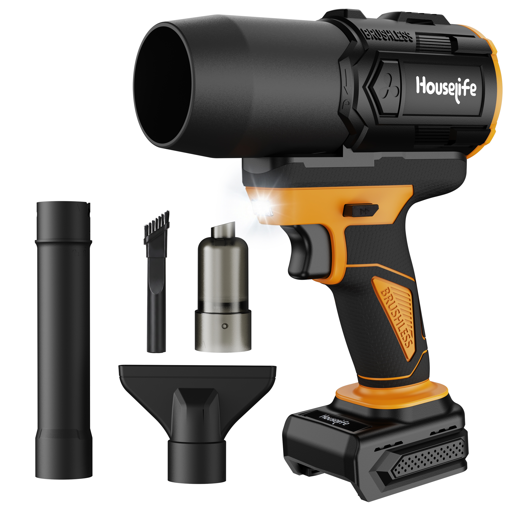
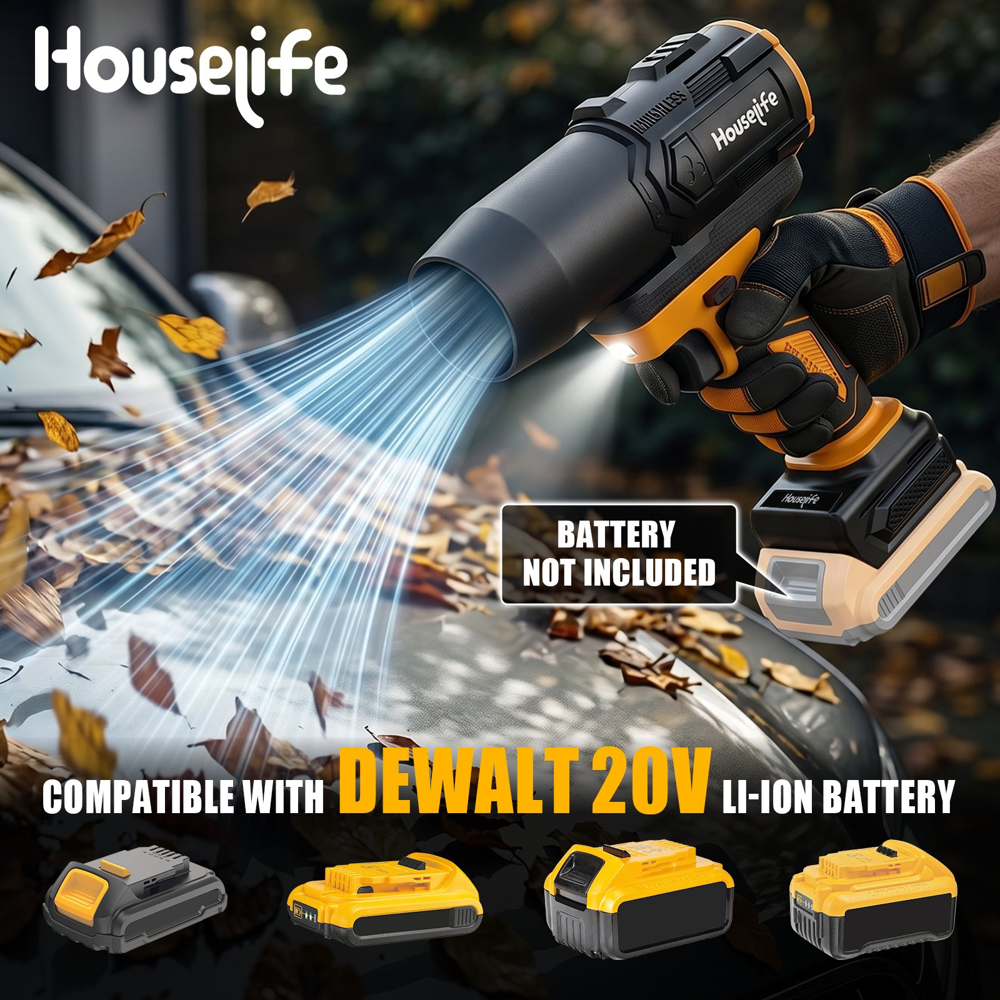
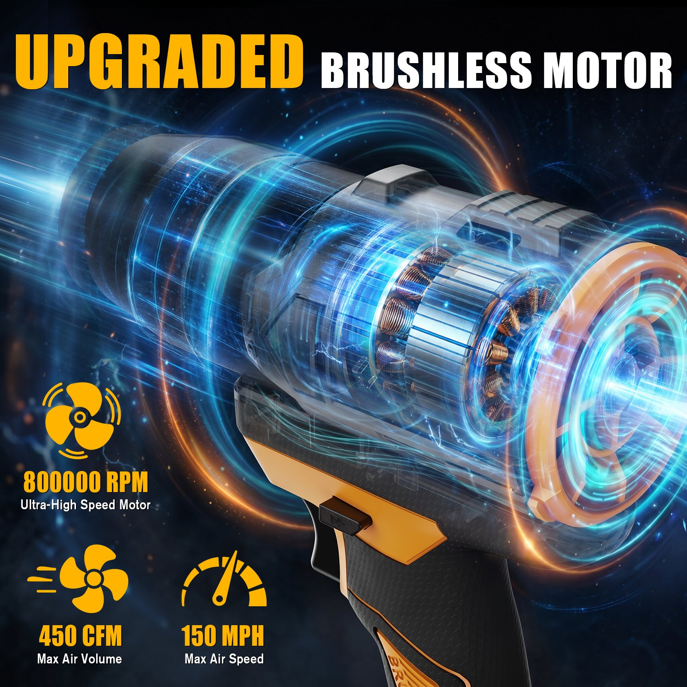

# 网站修改指南

用任何文本编辑器（推荐 VS Code、记事本也行）打开 `index.html`，按下面说明找到对应位置改就行。

> ⚠️ 只改文字内容，不要动 `< >` 里的标签和引号里的路径，改完保存刷新浏览器就能看到效果。

---

## 一、网站结构速览

整个文件从上到下分四大块：

| 区域 | 大约行号 | 干什么的 |
|------|----------|----------|
| `<style>` | 7-862 | 样式（颜色、字号、间距等），**一般不用动** |
| 首页内容 | 869-1093 | Hero、技能、项目卡片、经历、联系方式 |
| 10个项目详情 | 1112-1520 | 每个项目点进去后的页面 |
| `<script>` | 1525-1843 | 交互逻辑，**不用动** |

---

## 二、修改文字

### 1. 首页大标题（你的名字 + 副标题）

大约第 885-890 行：

```
<h1 class="hero-title">
  <span class="line"><span>黄少文</span></span>
  <span class="line"><span>Design</span></span>
```
- 把 `黄少文` 改成你想显示的名字
- 把 `Design` 改成你想显示的第二行文字

副标题在第 890 行：
```
<p class="hero-sub">电商产品视觉设计师 · 亚马逊 A+ 全链路转化</p>
```
- 改 `·` 前后的文字即可

### 2. 导航栏 Logo

第 872 行：
```
<div class="logo">SHAOWEN</div>
```
- 改 `SHAOWEN` 即可

### 3. 技能板块

第 898-907 行，每个技能是一个 `skill-cell`：

```
<div class="skill-cell"><div class="skill-category">Core</div><div class="skill-name">亚马逊 A+ 视觉</div><div class="skill-detail">高转化详情页设计 · A+ Content · ...</div></div>
```

- `skill-category`：分类名（如 Core、3D、AI）
- `skill-name`：技能名称
- `skill-detail`：技能描述

### 4. 项目卡片（首页展示）

以第一个项目为例，大约第 917-930 行：

```
<div class="project-item" onclick="showProject('blower')">
  <div class="project-cover">
    
  </div>
  <div class="project-info">
    <span class="project-number">01</span>
    <h2 class="project-name">Houselife 无刷吹吸一体机</h2>
    <p class="project-desc">为 Houselife 品牌打造全套产品视觉系统...</p>
    <div class="project-meta">
      <span>产品视觉</span>
      <span>2026</span>
    </div>
  </div>
</div>
```

可改的内容：
- `project-number`：编号（01、02…）
- `project-name`：项目名称
- `project-desc`：一句话介绍
- `project-meta`：标签和年份

**分类标签**在这段上方：
```
<div class="project-category">Power Tools</div>
```
- 改分类名即可

### 5. 工作经历

第 1077-1085 行，每段经历是一个 `exp-item`：

```
<div class="exp-item">
  <span class="exp-year">2024.03 — 2025.09</span>
  <div class="exp-content">
    <h3>视觉设计师</h3>
    <div class="exp-company">苏州星禾领创国际贸易有限公司 · 设计部</div>
    <p>负责亚马逊平台产品视觉设计...</p>
  </div>
  <div class="exp-detail">
    <div class="exp-detail-inner">
      <p>详细描述内容...</p>
    </div>
  </div>
</div>
```

可改的内容：
- `exp-year`：时间段
- `h3`：职位名称
- `exp-company`：公司名
- 第一个 `p`：一句话概括
- `exp-detail-inner` 里的 `p`：点击展开后的详细描述

自我评价在第 1079 行：
```
<div class="exp-about">熟悉电商平台视觉设计...</div>
```

### 6. 联系方式

第 1088-1103 行：

```
<a href="mailto:1842787797@qq.com">...1842787797@qq.com</a>
<a href="tel:19826098290">...19826098290</a>
```

- 改邮箱地址：两处 `1842787797@qq.com` 都要改
- 改电话：两处 `19826098290` 都要改

### 7. 页脚版权

第 1106 行：
```
<span>© 2026 黄少文</span>
```

---

## 三、修改图片

### 1. 替换项目封面图（首页卡片）

找到对应项目的 `project-cover`：
```

```

操作步骤：
1. 把新图片放进 `images/blower/` 文件夹
2. 把 `card.jpg` 改成新图片的文件名（如 `card-new.jpg`）
3. 新图片要和旧图片在同一文件夹里

### 2. 替换项目详情页的图片

每个项目详情页里，图片格式类似：
```

```

操作步骤：
1. 把新图片放进对应项目的 `images/` 子文件夹
2. 修改 `src="images/项目名/文件名.jpg"` 指向新图片
3. 顺便改一下 `alt="描述文字"`，这是图片的说明

### 3. 图片文件夹对照表

| 项目 | 文件夹 | 首页封面图 |
|------|--------|-----------|
| 吹吸一体机 | `images/blower/` | `card.jpg` |
| 棘轮扳手 | `images/ratchet/` | `02.jpg` |
| 松土机 | `images/tiller/` | `card.jpg` |
| 绿篱修剪机 | `images/hedger/` | `01.jpg` |
| 猫粮 | `images/orijen/` | `01.jpg` |
| Renogy太阳能板 | `images/solar/` | `01.jpg` |
| N-Type太阳能板 | `images/ntype-solar/` | `01.jpg` |
| SOKIOVOLA太阳能板 | `images/sokiovola/` | `01.jpg` |
| 圣诞纸巾 | `images/napkin/` | `01.jpg` |
| Santa Baby | `images/santa-baby/` | `01.jpg` |

---

## 四、修改项目详情页

每个项目详情页结构一样，以吹吸一体机为例（约第 1112 行开始）：

### 头部信息
```
<div class="meta-item"><span class="meta-label">Client</span><span class="meta-value">Houselife</span></div>
<div class="meta-item"><span class="meta-label">Year</span><span class="meta-value">2026</span></div>
<div class="meta-item"><span class="meta-label">Scope</span><span class="meta-value">主图设计 · 功能海报 · 场景展示</span></div>
```

### 大标题
```
<h1 class="detail-title">
  <span class="line"><span>Houselife</span></span>
  <span class="line"><span>Brushless Blower</span></span>
```

### 副标题
```
<p class="detail-subtitle">为 Houselife 无刷吹吸一体机打造电商视觉系统...</p>
```

### 图片布局类型

详情页有三种图片布局：

**全宽图**（一张大图占满）：
```
<div class="gallery-section"><div class="full-img"></div></div>
```

**左图右文**（offset-layout）：
```
<div class="gallery-section">
  <div class="offset-layout">
    <div class="offset-img"></div>
    <div class="offset-text">
      <div class="feature-tag">Feature 01</div>
      <h3>兼容 DeWalt 20V 电池</h3>
      <p>无缝适配得伟 20V MAX 电池生态...</p>
    </div>
  </div>
</div>
```

**右图左文**（offset-layout reverse）：
```
<div class="gallery-section">
  <div class="offset-layout reverse">
    <div class="offset-img"></div>
    <div class="offset-text">...</div>
  </div>
</div>
```

**双列图**（两张并排）：
```
<div class="gallery-section">
  <div class="two-col">
    
    
  </div>
</div>
```

**深色背景**：在 `gallery-section` 后加 `dark`，如 `class="gallery-section dark"`

### 底部导航（上一个/下一个项目）
```
<div class="project-nav">
  <a onclick="showProject('上一个项目ID')">...</a>
  <a onclick="showProject('下一个项目ID')">...</a>
</div>
```

项目 ID 对照：blower / ratchet / tiller / hedger / orijen / solar / ntype-solar / sokiovola / napkin / santa-baby

---

## 五、常见操作

### Q：怎么换一张图片？
1. 把新图片（.jpg 或 .png）放到对应项目的 images 文件夹里
2. 在 index.html 里找到那行 `黄少文 — 电商产品视觉设计师</title>`

### Q：图片不显示怎么办？
检查三件事：
1. 图片文件是否真的在对应文件夹里
2. 文件名大小写是否完全一致（`Card.jpg` 和 `card.jpg` 是不同的）
3. `src` 里的路径是否正确

### Q：改坏了怎么办？
每次修改前，复制一份 index.html 作为备份。改坏了就用备份覆盖回去。

---

## 六、文件结构

```
网站根目录/
├── index.html          ← 唯一需要编辑的文件
└── images/
    ├── blower/         ← 吹吸一体机图片
    ├── ratchet/        ← 棘轮扳手图片
    ├── tiller/         ← 松土机图片
    ├── hedger/         ← 绿篱修剪机图片
    ├── orijen/         ← 猫粮图片
    ├── solar/          ← Renogy太阳能板图片
    ├── ntype-solar/    ← N-Type太阳能板图片
    ├── sokiovola/      ← SOKIOVOLA太阳能板图片
    ├── napkin/         ← 圣诞纸巾图片
    └── santa-baby/     ← Santa Baby图片
```
